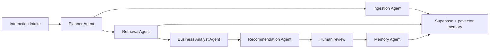

# 5-Minute Architecture Walkthrough

## Positioning

Flow360 is not a chatbot. It is a reusable agentic decision intelligence platform for workforce and staffing operations. The demo business case is Northstar Health Network, a strategic healthcare staffing account with urgent ICU nurse and Epic analyst requirements.

## System Flow

## Agent Responsibilities

- Planner Agent selects the workflow for the account situation.
- Ingestion Agent stores transcripts, notes, emails, and uploaded files as raw and semantic memory.
- Retrieval Agent gathers account history, candidate data, playbooks, policies, and prior decisions.
- Business Analyst Agent identifies risks, opportunities, missing information, and decision points.
- Recommendation Agent generates ranked actions with owner, due date, confidence, rationale, and evidence.
- Human-in-the-Loop review accepts or rejects recommendations before execution.
- Memory Agent writes review outcomes into persistent episodic/profile memory.

## Memory Design

- Raw memory: original uploaded content.
- Semantic memory: embedded chunks in Supabase pgvector.
- Episodic memory: agent runs, accepted/rejected recommendations, reviewer notes.
- Profile memory: account-level summaries and known stakeholder context.
- Rule memory: playbooks, SLA policies, escalation rules, and commercial thresholds.

## Technology Choices

- LangGraph keeps orchestration explicit and easy to explain.
- LlamaIndex handles document chunking and retrieval-friendly parsing.
- Groq provides fast LLM reasoning with API-key rotation.
- Supabase provides Postgres, pgvector, and storage in one hackathon-friendly stack.
- Next.js gives a polished operator console for judges to use quickly.

## Why This Impresses XLVentures

XLVentures publicly describes itself as building people context infrastructure. Flow360 maps directly to that thesis: it turns people, account, role, compliance, and workflow context into explainable operating decisions.

